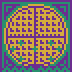

#  Waffle Scanner

>A game made for Games Factory Jam and Weekly Game Jam.

**Connect the plugs fastly to copy the waffles before the time ends!**

Waffle Scanner is a short time management puzzle that brings you into a waffle copying kitchen - in which some of the power plugs are on high voltage, some are on low voltage, and their wires are all messed up! Connect your waffle scanners properly to avoid explosions, and reach the goal before the time finishes.

Can you manage to be a great waffle master?

**Made with:**

- **Love**
- [Godot Engine](https://godotengine.org/)
- [Piskel](https://www.piskelapp.com/)
- [Pxtone Collage](http://studiopixel.sakura.ne.jp/pxtone/)

**Made by:**

- [William Tumeo](https://twitter.com/williamd1k0)
- [Lucia Wolf Schafer](https://twitter.com/5deouros)

**Release notes:**

This game was made using a nightly version of Godot Engine 3 so we can test the OpenGL ES2  backport (aka GLES2).

The GLES2 backport is still in development, so it may contain some visual glitches.

If your PC/Android already supports GLES3, just download the GLES3 version and have fun.

If your PC does not support GLES3, try the GLES2 build.

During the tests with the GLES2, I experienced only a visual glitch that blurred all textures, if this occurs, try to close the game and open it again.

If your Android device does not support GLES3, unfortunately you will not be able to play because the GLES2 backport is not yet implemented on mobile devices.

**License:**

Code (.gd, .tscn, .tres, etc) are licensed under MIT License.

Graphic and sound assets (.png, .ogg, etc) are licensed under Attribution 4.0 International (CC BY 4.0) by Lúcia Wolf Schafer.